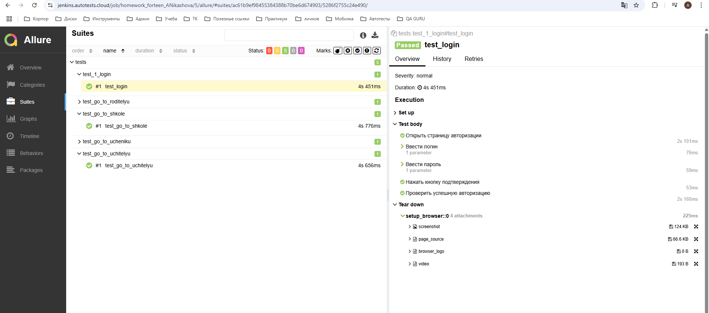
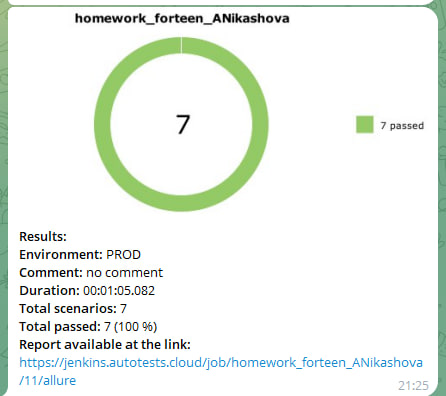

# Автоматизированные UI-тесты для домашего задания  QA quru

## 📌 О проекте

Автоматизированные тесты для веб-интерфейса образовательной платформы, покрывающие:
- Авторизацию пользователей
- Навигацию между ролями (Ученик, Учитель, Родитель, Школа)
- Проверку переходов между страницами

## 🛠 Технологический стек

- **Python 3.9+** - язык программирования
- **Selenium WebDriver** - автоматизация браузера
- **Selene** - удобная обертка над Selenium
- **Pytest** - фреймворк для тестирования
- **Allure** - генератор отчетов
- **Jenkins** - система непрерывной интеграции
- **Selenoid** - контейнеризованный запуск браузеров

## 📂 Структура проекта
project/
├── .env # Файл с переменными окружения  
├── pytest.ini # Конфигурация Pytest  
├── requirements.txt # Зависимости Python  
├── Jenkinsfile # Конфигурация Jenkins  
├── pages/ # Page Object модели  
│ ├── base_page.py # Базовые методы   
│ ├── header_page.py # Шапка сайта  
│ └── login_page.py # Страница авторизации  
├── locators/ # Локаторы элементов  
│ ├── header_locators.py # Локаторы шапки  
│ └── login_page_locators.py # Локаторы логина  
├── tests/ # Тесты  
│ ├── test_go_to_ucheniku.py # Тесты раздела "Ученику"  
│ ├── test_go_to_roditelyu.py # Тесты раздела "Родителю"  
│ ├── test_go_to_uchitelyu.py # Тесты раздела "Учителю"  
│ ├── test_go_to_shkole.py # Тесты раздела "Школе"
│ └── test_login.py # Тесты авторизации  
   ├── test_go_to_catalog.py # Тесты раздела "Каталог"
   ├── test_go_to_cart.py # Тесты раздела "Корзина"
└── utils/ # Вспомогательные утилиты  
└── attach.py # Генерация аттачментов для Allure  
## 🌐 CI/CD и Мониторинг

###  **Jenkins Pipeline**

**Ссылка на сборку**:  
[https://jenkins.autotests.cloud/job/homework_forteen_ANikashova/](https://jenkins.autotests.cloud/job/homework_forteen_ANikashova/)

**Особенности пайплайна**:
- Автоматический запуск тестов в Selenoid
- Генерация Allure-отчёта
- Отправка уведомлений в Telegram

###  Allure Report
**Пример отчёта**:  
[https://jenkins.autotests.cloud/job/homework_forteen_ANikashova/4/allure/](https://jenkins.autotests.cloud/job/homework_forteen_ANikashova/4/allure/)

###  Telegram Bot
**Бот для уведомлений**:  
[@homework_13_Nikashova_bot](https://t.me/homework_13_Nikashova_bot)

